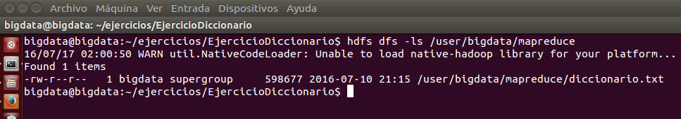
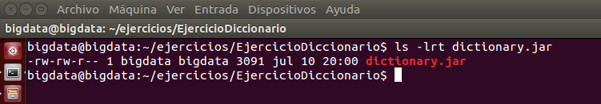
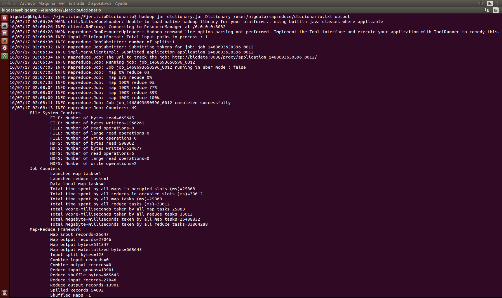
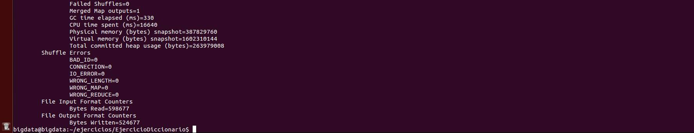
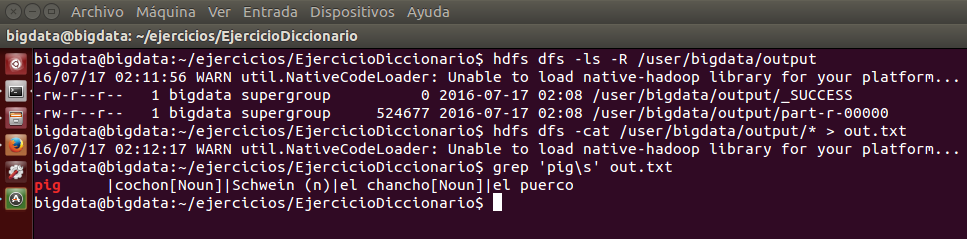

***
# Hadoop: Ejercicio Diccionarios.
***
- Autor: Juan A. García Cuevas
- Fecha: 10/07/2016

***

## ENUNCIADO:

Partiendo de los siguientes diccionarios Inglés a otro idioma (Español, italiano, Francés y Alemán), crear un nuevo fichero en donde tengamos cada palabra en inglés (clave) asociada a cada una de las traducciones con un separador.

**1. Descargar el fichero**

Lo primero que haremos es descargarnos los diferentes diccionarios a una nueva carpeta (Emplear por ejemplo comando wget):
```bash
    wget http://www.ilovelanguages.com/IDP/files/Spanish.txt
    wget http://www.ilovelanguages.com/IDP/files/Italian.txt
    wget http://www.ilovelanguages.com/IDP/files/French.txt
    wget http://www.ilovelanguages.com/IDP/files/German.txt
```

**2. Merge de ficheros**

Como Hadoop trabaja mejor con ficheros grandes, haremos un merge de los 4 ficheros para obtener un único fichero diccionario.
Por ejemplo se puede emplear el comando CAT redirigiendo la salida a un nuevo fichero llamado dictionary.txt

**3. Subir el fichero a HDFS**

Empleando alguno de los comandos de subida a HDFS mover el fichero a una nueva carpeta en la ruta /user/bigdata/mapreduce poniéndole el nombre diccionario.txt.

**4. Crear nuestro fichero Dictionary.java**

Partiendo de los siguientes pantallazos o del documento de ejemplo, crear un fichero llamado Dictionary.java

**5. Compilar el fichero**

Al compilarlo, os aparecerá un mensaje de un método deprecated. Revisar el código y rectificarlo para compilarlo correctamente.

**6. Crear el .jar**

**7. Ejecutar el proceso map reduce**

En este ejemplo, como hemos visto no hay parámetros de entrada ya que vienen indicados en el código.

**8. Devolver traducción de pig**

***

## SOLUCIÓN:

### 1. Iniciamos el sistema (si no lo está ya)

>
>NOTA: debe existir la variable de entorno:
>
>- $HADOOP_HOME=/home/bigdata/hadoop
>

```bash
# Accedemos al directorio de hadoop y arrancamos los demonios del sistema
cd $HADOOP_HOME
./sbin/start-dfs.sh
./sbin/start-yarn.sh
./sbin/mr-jobhistory-daemon.sh start historyserver

# Comprobamos que los demonios estén arrancados
jps
```


### 2. Creamos en local una carpeta para el proyecto, descargamos los ficheros de diccionarios y los combinamos en un único fichero:

```bash
# Crea la carpeta del proyecto en local y se posiciona en ella:
mkdir /home/bigdata/ejercicios/EjercicioDiccionario/
cd /home/bigdata/ejercicios/EjercicioDiccionario/

# Descarga los diccionarios
wget http://www.ilovelanguages.com/IDP/files/Spanish.txt
wget http://www.ilovelanguages.com/IDP/files/Italian.txt
wget http://www.ilovelanguages.com/IDP/files/French.txt
wget http://www.ilovelanguages.com/IDP/files/German.txt
ll

# Copia los diccionarios en un único fichero 'dictionary.txt'
cat French.txt > dictionary.txt
cat Spanish.txt >> dictionary.txt
cat Italian.txt >> dictionary.txt
cat German.txt >> dictionary.txt
ll
```

### 3. Creamos en HDFS una carpeta para el proyecto y subimos el fichero de diccionario combinado:

```bash
# Crea la carpeta en HDFS
hdfs dfs -mkdir /user/bigdata/mapreduce

# Copia el fichero de local a HDFS, renombrándolo
hdfs dfs -appendToFile dictionary.txt /user/bigdata/mapreduce/diccionario.txt
hdfs dfs -ls /user/bigdata/mapreduce
```




### 4. Creamos en local el fichero Java Dictionary.java:

>
> NOTA: No he modificado el fichero Dictionary.java, sino que lo he dejado tal y como venía en los materiales del class room:
>
> - FileInputFormat.addInputPath(job, new Path(args[0]));
>
> - FileOutputFormat.setOutputPath(job, new Path(args[1]));
>

```bash
gedit Dictionary.java # ... se añade el código fuente Java ...
```
- [Dictionary.java](src/Dictionary.java)

### 5. Compilamos el código fuente Java y creamos el fichero jar:

```bash
# Compila el código fuente Java
javac -classpath $HADOOP_HOME/share/hadoop/common/hadoop-common-2.7.2.jar:$HADOOP_HOME/share/hadoop/common/lib/hadoop-annotations-2.7.2.jar:$HADOOP_HOME/share/hadoop/mapreduce/hadoop-mapreduce-client-core-2.7.2.jar Dictionary.java
ls -lrt *.class

# Empaqueta en un ficheo jar las clases java compiladas
jar cf dictionary.jar Dictionary*.class
ls -lrt dictionary.jar
```



### 6. Ejecutamos el programa:

> NOTA: Como he dejado el fichero Dictionary.java original, sí tengo que indicar los parámetros.

```bash
hadoop jar dictionary.jar Dictionary /user/bigdata/mapreduce/diccionario.txt output
```




### 7. Obtenemos la traducción de pig:

```bash
# Comprueba el directorio y ficheros de resultados
hdfs dfs -ls -R /user/bigdata/output

# Copia los resultados en un fichero de texto en local
hdfs dfs -cat /user/bigdata/output/* > out.txt

# Localiza las traducciones de 'pig' en el fichero de texto
grep 'pig\s' out.txt
```

- Resultado:

    pig	|cochon[Noun]|Schwein (n)|el chancho[Noun]|el puerco




***

### 99. Detenemos los demonios

```bash
# Accedemos al directorio de hadoop y paramos los demonios del sistema
cd $HADOOP_HOME
./sbin/stop-dfs.sh
./sbin/stop-yarn.sh
./sbin/mr-jobhistory-daemon.sh stop historyserver

# Comprobamos que los demonios no estén arrancados
jps
```

***
