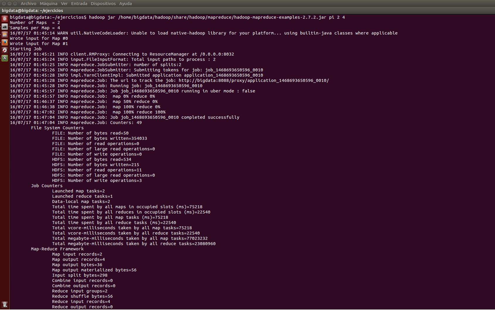
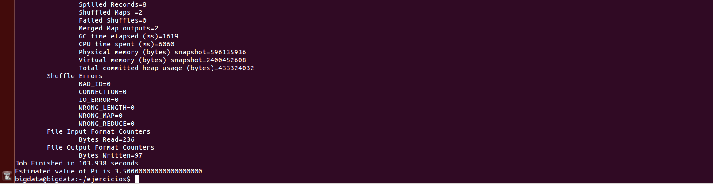
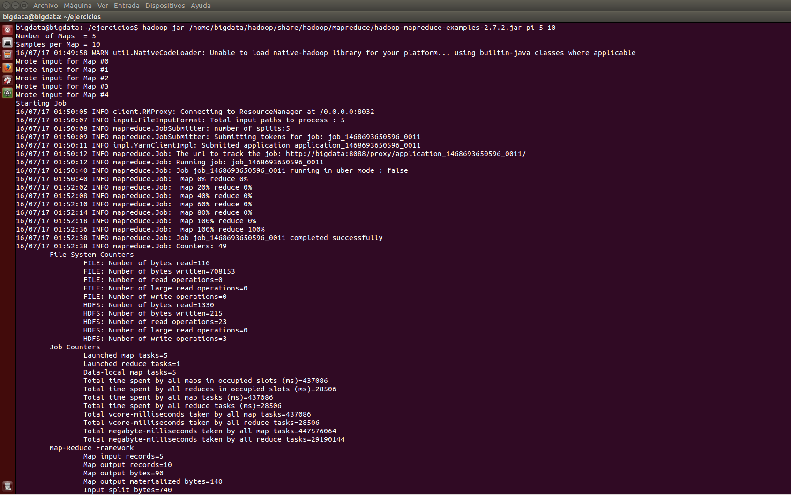
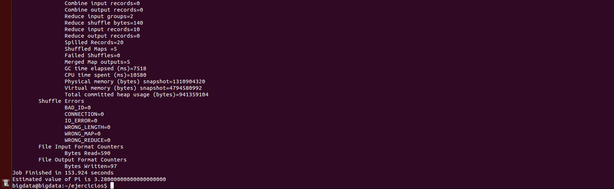

***
# Hadoop: Ejercicio PI.
***
- Autor: Juan A. García Cuevas
- Fecha: 10/07/2016

***

## ENUNCIADO:

Ejecutar el programa "pi" con los siguientes parámetros de entrada e indicar el valor devuelto.

- Programa: pi
    - Nº de mapeos:  2
    - Nº de muestras por mapeo: 4


Ejecutar el programa "pi" con los siguientes parámetros de entrada e indicar el valor devuelto.

- Programa: pi
    - Nº de mapeos:  5
    - Nº de muestras por mapeo: 10

***

## SOLUCIÓN:

### 0. Iniciamos el sistema (si no lo está ya)

>
>NOTA: deben existir las variables de entorno:
>
>- $HADOOP_HOME=/home/bigdata/hadoop
>
>- $HIVE_HOME=/home/bigdata/hive
>

```bash
# Accedemos al directorio de hadoop y arrancamos los demonios del sistema
cd $HADOOP_HOME
./sbin/start-dfs.sh
./sbin/start-yarn.sh
./sbin/mr-jobhistory-daemon.sh start historyserver

# Comprobamos que los demonios estén arrancados
jps
```


### 1. Ejecutar el programa "pi" con los siguientes parámetros de entrada e indicar el valor devuelto.

- Programa: pi
    - Nº de mapeos:  2
    - Nº de muestras por mapeo: 4

- Ejecutar:
```bash
    hadoop jar /home/bigdata/hadoop/share/hadoop/mapreduce/hadoop-mapreduce-examples-2.7.2.jar pi 2 4
```
- Resultado:

    Job Finished in 137.768 seconds
    Estimated value of Pi is 3.50000000000000000000





### 2. Ejecutar el programa "pi" con los siguientes parámetros de entrada e indicar el valor devuelto.

- Programa: pi
    - Nº de mapeos:  5
    - Nº de muestras por mapeo: 10

- Ejecutar:
```bash
    hadoop jar /home/bigdata/hadoop/share/hadoop/mapreduce/hadoop-mapreduce-examples-2.7.2.jar pi 5 10
```
- Resultado:

    Job Finished in 187.558 seconds
    Estimated value of Pi is 3.28000000000000000000




***

### 99. Detenemos los demonios

```bash
# Accedemos al directorio de hadoop y paramos los demonios del sistema
cd $HADOOP_HOME
./sbin/stop-dfs.sh
./sbin/stop-yarn.sh
./sbin/mr-jobhistory-daemon.sh stop historyserver

# Comprobamos que los demonios no estén arrancados
jps
```

***

