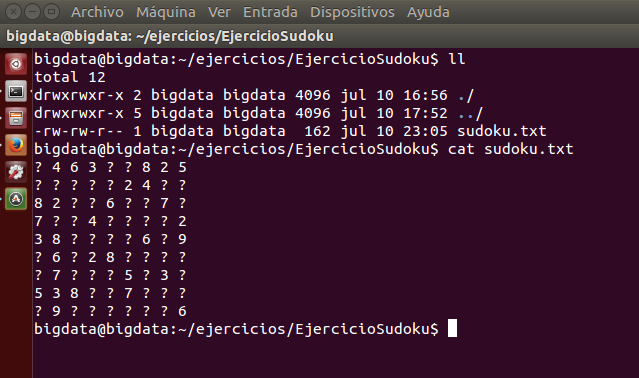
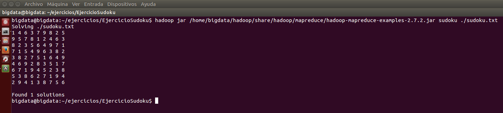

***
# Hadoop: Ejercicio Sudoku.
***
- Autor: Juan A. García Cuevas
- Fecha: 10/07/2016

***

## ENUNCIADO:

Ejecutar el programa sudoku con los siguientes parámetros:

 ‐ Programa: sudoku

 ‐ Path: fichero

En la ruta del fichero habrá que indicar la ruta en la que se encuentre un fichero que tendrá la siguiente información:

        ? 4 6 3 ? ? 8 2 5
        ? ? ? ? ? 2 4 ? ?
        8 2 ? ? 6 ? ? 7 ?
        7 ? ? 4 ? ? ? ? 2
        3 8 ? ? ? ? 6 ? 9
        ? 6 ? 2 8 ? ? ? ?
        ? 7 ? ? ? 5 ? 3 ?
        5 3 8 ? ? 7 ? ? ?
        ? 9 ? ? ? ? ? ? 6

Indicar todos los resultados del sudoku de ejemplo

***

## SOLUCIÓN:

### 0. Iniciamos el sistema (si no lo está ya)

>
>NOTA: deben existir las variables de entorno:
>
>- $HADOOP_HOME=/home/bigdata/hadoop
>
>- $HIVE_HOME=/home/bigdata/hive
>

```bash
# Accedemos al directorio de hadoop y arrancamos los demonios del sistema
cd $HADOOP_HOME
./sbin/start-dfs.sh
./sbin/start-yarn.sh
./sbin/mr-jobhistory-daemon.sh start historyserver

# Comprobamos que los demonios estén arrancados
jps
```


### 1. Creamos en local una carpeta para el proyecto y el fichero de texto del sudoku:

```bash
    # Crea la carpeta del proyecto en local y se posiciona en ella
    mkdir /home/bigdata/ejercicios/EjercicioSudoku
    cd /home/bigdata/ejercicios/EjercicioSudoku

    # Crea el fichero de texto
    touch sudoku.txt
    echo "? 4 6 3 ? ? 8 2 5" > sudoku.txt
    echo "? ? ? ? ? 2 4 ? ?" >> sudoku.txt
    echo "8 2 ? ? 6 ? ? 7 ?" >> sudoku.txt
    echo "7 ? ? 4 ? ? ? ? 2" >> sudoku.txt
    echo "3 8 ? ? ? ? 6 ? 9" >> sudoku.txt
    echo "? 6 ? 2 8 ? ? ? ?" >> sudoku.txt
    echo "? 7 ? ? ? 5 ? 3 ?" >> sudoku.txt
    echo "5 3 8 ? ? 7 ? ? ?" >> sudoku.txt
    echo "? 9 ? ? ? ? ? ? 6" >> sudoku.txt

    # Comprueba el fichero creado
    ll
    cat sudoku.txt
```




### 2. Ejecutamos el programa sudoku y mostramos los resultados.

```bash
    # Ejecutar el proceso sudoku
    hadoop jar /home/bigdata/hadoop/share/hadoop/mapreduce/hadoop-mapreduce-examples-2.7.2.jar sudoku ./sudoku.txt
```

* Resultado:

```
    Solving ./sudoku.txt
    1 4 6 3 7 9 8 2 5
    9 5 7 8 1 2 4 6 3
    8 2 3 5 6 4 9 7 1
    7 1 5 4 9 6 3 8 2
    3 8 2 7 5 1 6 4 9
    4 6 9 2 8 3 5 1 7
    6 7 1 9 4 5 2 3 8
    5 3 8 6 2 7 1 9 4
    2 9 4 1 3 8 7 5 6

    Found 1 solutions
```




***

### 99. Detenemos los demonios

```bash
# Accedemos al directorio de hadoop y paramos los demonios del sistema
cd $HADOOP_HOME
./sbin/stop-dfs.sh
./sbin/stop-yarn.sh
./sbin/mr-jobhistory-daemon.sh stop historyserver

# Comprobamos que los demonios no estén arrancados
jps
```

***

