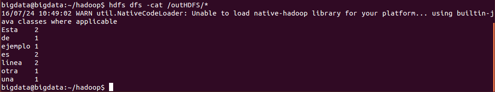

***
# Hadoop: Ejercicios.
***
- Autor: Juan A. García Cuevas
- Fecha: 10/07/2016

***

### 1. Devolver el resultado de ejecutar el siguiente comando
$HADOOP_HOME/bin/hdfs dfs ‐cat /outHDFS/*

```
    bigdata@bigdata:~/ejemploHadoop/ejercicio1$ hdfs dfs -cat /outHDFS/*
    16/07/10 11:48:32 WARN util.NativeCodeLoader: Unable to load native-hadoop library for your platform... using builtin-java classes where applicable
    Esta	2
    de	1
    ejemplo	1
    es	2
    línea	2
    otra	1
    una	1
    bigdata@bigdata:~/ejemploHadoop/ejercicio1/inlocal$
```



### 2. ¿Cuál de los siguientes funcionalidades pertenecen a un NameNode de HDFS?
- a. Transferir bloques de datos de los datanodes a los clientes.
- **b. Mantener el árbol del sistema de archivos y los metadatos de todos los ficheros y directorios**
- c. Controlar los procesos de Map Reduce.
- d. Almacenar bloques de datos.
- e. Ninguna de las opciones es correcta.

#### Respuesta: B

### 3. ¿Cuál de los siguientes funcionalidades pertenece a un DataNode de HDFS?
- a. Mantener el árbol del sistema de archivos y los metadatos de todos los ficheros y directorios.
- b. Controlar la ejecución de una tarea de mapeo o de reduce individual.
- c. Gestionar el sistema de espacios de nombres de los archivos.
- **d. Almacenar y recuperar bloques cuando los clientes o el NameNode lo solicita.**
- e. Ninguna de las opciones es correcta.

#### Respuesta: D

### 4. ¿Cuál de las siguientes frases es cierta con respecto a YARN?
- a. Implementa un gestor de recursos externos para todos los frameworks de Hadoop.
- b. Permitir acceso a los datos de HDFS a programas que no estén desarrollados en Hadoop.
- c. Permitir a múltiples Namenodes con sus propios namespaces, compartir el pool de Datanodes.
- _d. Usar el JournalNode para decidir el NameNode activo._
- e. Ninguna de las anteriores es correcta.

#### Respuesta: 

### 5. HDFS está diseñado para
- a. Ficheros grandes, acceso continuo a los datos y hardware de grandes prestaciones.
- b. Ficheros pequeños, acceso continuo a los datos y hardware básico.
- c. Ficheros grandes, baja latencia de acceso y hardware básico.
- **d. Ficheros grandes, acceso continuo a los datos y hardware básico.**
- e. Ninguna de las anteriores es correcta.

#### Respuesta: D

### 6. ¿Qué es común a Pig y Hive?
- a. Permiten múltiples y aleatorias escrituras y lecturas.
- b. _Traducen lenguajes de alto nivel a trabajos de Map Reduce._
- c. Todas operan con estructura de datos JSON.
- d. Todas son lenguajes de flujos de datos.
- e. Ninguna de las anteriores es correcta.

#### Respuesta: 

### 7. ¿Qué es Flume?
- a. Un sistema de archivos distribuido.
- b. Una plataforma de ejecución de tareas de MapReduce.
- c. Un lenguaje de programación que traduce queries de alto nivel en tareas de map reduce.
- **d. Un servicio para mover grandes cantidades de datos en un cluster una vez los datos se han generado.**
- e. Ninguna de las anteriores.

#### Respuesta: D

### 8. ¿En cuál de los siguientes escenarios usarías Hadoop?
- **a. Analizar los signos vitales de un bebé en tiempo real.**
- **b. Obtener las tendencias de acciones bursátiles cada minuto.**
- **c. Procesar un sensor meteorológico para predecir la trayectoria de un huracán.**
- **d. Procesar billones de mensajes de email para ejecutar análisis de texto.**
- e. Ninguna de las anteriores.

#### Respuesta: A, B, C, D

### 9. ¿Cuál de las siguientes frases es cierta?
- a. Hadoop es una nueva tecnología diseñada para reemplazar las bases de datos relacionales.
- b. Hadoop incluye componentes open source y closed source.
- **c. Hadoop se puede usar para bigdata, DSS y OLTP.**
- d. Todas las anteriores son correctas.
- e. Ninguna de las anteriores es correcta.

#### Respuesta: C

***

### Glosario
- DSS: Sistemas de soporte a decisiones
- OLTP: Procesamiento de transacciones en linea

***