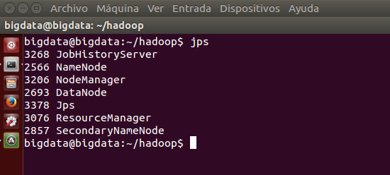
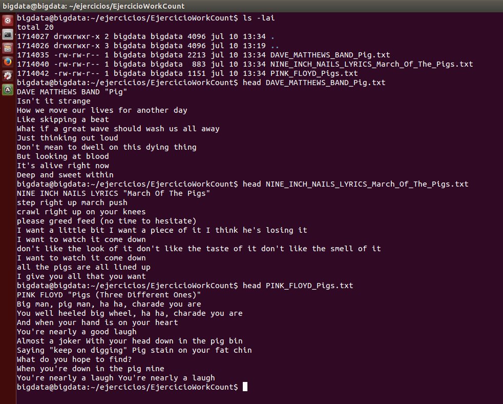
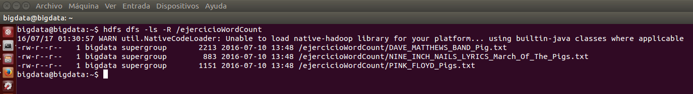
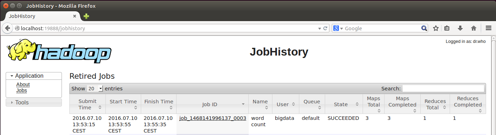

***
# Hadoop: Ejercicio Word Count.
***
- Autor: Juan A. García Cuevas
- Fecha: 10/07/2016

***

## ENUNCIADO:

Partiendo de las letras de algunas canciones, Crear ficheros de texto en la máquina ubuntu, subir los ficheros a HDFS, ejecutar un word count y resolver las preguntas del formulario.

- Ficheros de canciones:
    - [NINE INCH NAILS LYRICS "March Of The Pigs"](data/NINE_INCH_NAILS_LYRICS_March_Of_The_Pigs.txt)
    - [PINK FLOYD "Pigs (Three Different Ones)"](data/PINK_FLOYD_Pigs.txt)
    - [DAVE MATTHEWS BAND "Pig"](data/DAVE_MATTHEWS_BAND_Pig.txt)

**1. Crear ficheros de texto en la máquina ubuntu**

**2. Subir los ficheros a HDFS**

**3. Ejecutar un word count y resolver las preguntas del formulario.**:

- A. Acceder al jobhistory e indicar los valores de "Status" y "Map Total" del job con el nombre "word count"
- B. Palabra que se repite más veces
- C. Palabra que se repite 6 veces
- D. Cuántas veces aparece la palabra eyes

***

## SOLUCIÓN:

### 1. Iniciamos el sistema (si no lo está ya)

>
>NOTA: debe existir la variable de entorno:
>
>- $HADOOP_HOME=/home/bigdata/hadoop
>

```bash
# Accedemos al directorio de hadoop y arrancamos los demonios del sistema
cd $HADOOP_HOME
./sbin/start-dfs.sh
./sbin/start-yarn.sh
./sbin/mr-jobhistory-daemon.sh start historyserver

# Comprobamos que los demonios estén arrancados
jps
```



### 2. Creamos en local una carpeta para el proyecto y los ficheros de texto de las canciones:

```bash
# Crea la carpeta del proyecto en local y se posiciona en ella
mkdir /home/bigdata/ejercicios
mkdir /home/bigdata/ejercicios/EjercicioWorkCount
cd /home/bigdata/ejercicios/EjercicioWorkCount

# Crea los ficheros de texto con las letras de las canciones
gedit DAVE_MATTHEWS_BAND_Pig.txt # ... copiar, pegar, grabar y salir del editor
gedit NINE_INCH_NAILS_LYRICS_March_Of_The_Pigs.txt # ... copiar, pegar, grabar y salir del editor
gedit PINK_FLOYD_Pigs.txt # ... copiar, pegar, grabar y salir del editor

# Lista y comprueba los ficheros creados
ls -lai 
head DAVE_MATTHEWS_BAND_Pig.txt
head NINE_INCH_NAILS_LYRICS_March_Of_The_Pigs.txt
head PINK_FLOYD_Pigs.txt
```



### 3. Creamos en HDFS una carpeta para el proyecto y subimos los ficheros de las canciones:

```bash
# Copia los ficheros de texto al HDFS
cd ..
hdfs dfs -copyFromLocal EjercicioWorkCount/ /ejercicioWordCount
cd /home/bigdata/ejercicios/EjercicioWorkCount

# Comprueba el directorio y los ficheros
hdfs dfs -ls -R /ejercicioWordCount
```



### 4. Ejecutamos el programa word count y resolvemos las preguntas del formulario.

```bash
# Ejecuta el proceso de contado de palabras
hadoop jar /home/bigdata/hadoop/share/hadoop/mapreduce/hadoop-mapreduce-examples-2.7.2.jar wordcount /ejercicioWordCount /ejercicioWordCount_out

# Comprueba el directorio y ficheros de resultados
hdfs dfs -ls -R /ejercicioWordCount_out

# Copia los resultados en un fichero de texto en local
hdfs dfs -cat /ejercicioWordCount_out/* > out.txt
```

#### 4.A. Acceder al jobhistory e indicar los valores de "Status" y "Map Total" del job con el nombre "word count"

- Abrimos un navegador web y accedemos a la interfaz web de Map Reduce JobHistory:
    - Url: http://localhost:19888/jobhistory

- Los valores del Job 'word count' son:
    - State: SUCCEEDED
    - Maps Total: 3



#### 4.B. Palabra que se repite más veces:

- Resultado:

    - the:      33

#### 4.C. Palabra que se repite 6 veces:

```bash
grep 6 out.txt
```
- Resultado:

    - You:      6
    - Charade:  6
    - ha:       6
    - ha,:      6
    - laugh:    6
    - our:      6
    - we:       6

#### 4.D. Cuántas veces aparece la palabra eyes:

```bash
    grep eyes out.txt
```
- Resultado:

    - eyes:   3
    - eyes,:  1

***

### 99. Detenemos los demonios

```bash
# Accedemos al directorio de hadoop y paramos los demonios del sistema
cd $HADOOP_HOME
./sbin/stop-dfs.sh
./sbin/stop-yarn.sh
./sbin/mr-jobhistory-daemon.sh stop historyserver

# Comprobamos que los demonios no estén arrancados
jps
```

***

