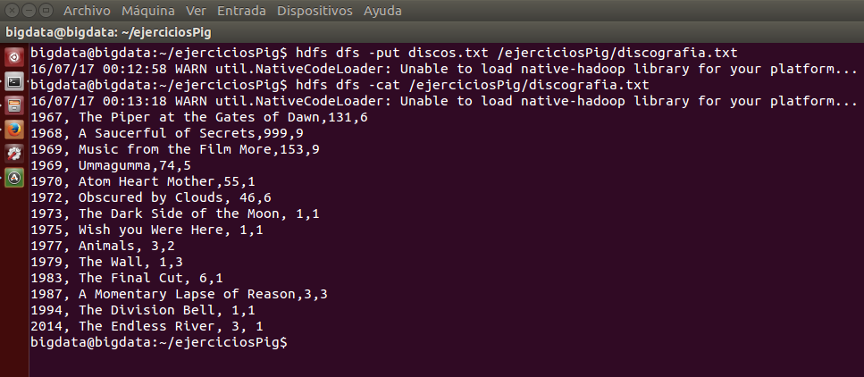
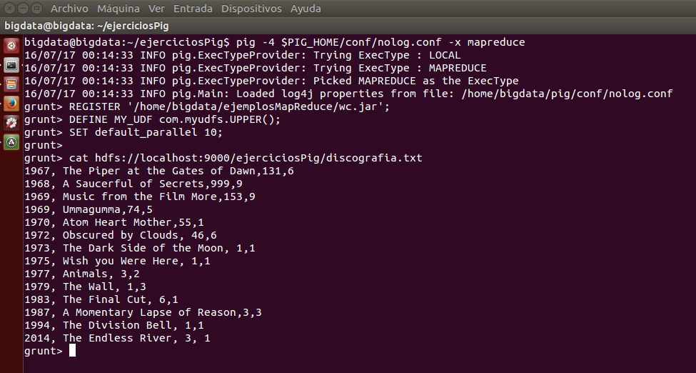
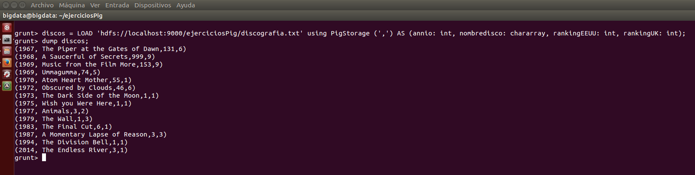
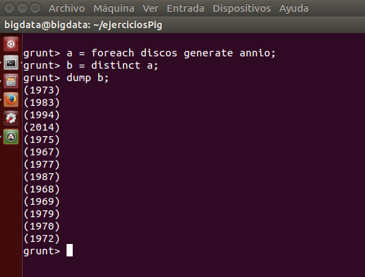

***
# Hadoop: Ejercicios de PIG.
***
- Autor: Juan A. García Cuevas
- Fecha: 17/07/2016

***

Partiendo de la discografía de Pink Floyd (año, nombre disco, ranking EEUU, ranking UK):

>    1967, The Piper at the Gates of Dawn,131,6

>    1968, A Saucerful of Secrets,999,9

>    1969, Music from the Film More,153,9

>    1969, Ummagumma,74,5

>    1970, Atom Heart Mother,55,1

>    1972, Obscured by Clouds, 46,6

>    1973, The Dark Side of the Moon, 1,1

>    1975, Wish you Were Here, 1,1

>    1977, Animals, 3,2

>    1979, The Wall, 1,3

>    1983, The Final Cut, 6,1

>    1987, A Momentary Lapse of Reason,3,3

>    1994, The Division Bell, 1,1

>    2014, The Endless River, 3, 1

## 1. Crear un fichero llamado discos.txt

```bash
    # Crea en local la carpeta del proyecto y se posiciona en ella
    mkdir /home/bigdata/ejerciciosPig
    cd /home/bigdata/ejerciciosPig

    # Crea el fichero de texto con la discografía de Pink Floyd
    gedit discos.txt # ... copiar, pegar, grabar y salir del editor

    # Muestra el inicio del fichero de texto
    head discos.txt
```


## 2. Arrancar HDFS, Yarn y el job history

> NOTA: deben existir las variables de entorno:
>
>       $HADOOP_HOME=/home/bigdata/hadoop
>
>       $PIG_HOME=/home/bigdata/pig

```bash
    # Accede al directorio de hadoop
    cd $HADOOP_HOME

    # Arranca los demonios del sistema (no es necesario indicar './sbin/', pero se incluye por claridad)
    ./sbin/start-dfs.sh
    ./sbin/start-yarn.sh
    ./sbin/mr-jobhistory-daemon.sh start historyserver

    # Comprueba que los demonios estén arrancados
    jps
```


## 3. Subir el fichero a HDFS dentro de la carpeta /ejerciciosPig/discografia.txt

```bash
    # Copia los ficheros de texto al HDFS
    hdfs dfs -put discos.txt /ejerciciosPig/discografia.txt

    # Comprueba el fichero subido
    hdfs dfs -cat /ejerciciosPig/discografia.txt
```



## 4. Ejecutar la instrucción ls sobre Hadoop para indicar el tamaño del fichero
```bash
    hdfs dfs -du /ejerciciosPig/discografia.txt
```


## 5. Arrancar pig en modo distribuido (si se desea eliminar trazas de log) y ejecutar el siguiente comando: cat hdfs://localhost:9000 ejerciciosPig/discografia.txt para confirmar que los primeros puntos han funcionado correctamente y el fichero está subido a HDFS

> Nota: La configuración del niverl de error del log debe estar configurada en el fichero:
>
>       /home/bigdata/pig/conf/nolog.conf
>
> Por ejemplo:
>
>       log4j.rootLogger=fatal

```bash
    pig -4 $PIG_HOME/conf/nolog.conf -x mapreduce
    cat hdfs://localhost:9000/ejerciciosPig/discografia.txt
```



## 6. Cargar el fichero de hdfs en una variable llamada discos
```bash
    discos = LOAD 'hdfs://localhost:9000/ejerciciosPig/discografia.txt' using PigStorage (',') AS (annio: int, nombredisco: chararray, rankingEEUU: int, rankingUK: int);
    dump discos;
```



## 7. Calcular los discos que estuvieron a la vez en el top 5 de EEUU y de UK (indicar también el resultado)
```bash
```

## 8. Obtener la máxima y mínima posición que ocuparon los discos de Pink Floyd en EEUU y en UK (indicar también el resultado)  empleando los comandos de LATIN PIG
```bash
```

## 9. Explica con tus propias palabras lo que se desea obtener con los siguientes comandos e indica el resultado obtenido.

- Obtener una variable 'a' con todos los años de las canciones de la variable 'discos'.
```bash
    a = foreach discos generate anio;
```

- Obtener en una variable 'b' los años distintos de la variable 'a'.
```bash
    b = distinct a;
```

- Mostrar el contenido de la variable 'b' (los años distintos de las canciones de Pink Floid de la lista).
```bash
    dump b;
```



## 10. (opcional) Empleando UDFs extrae información útil de la discografía.


