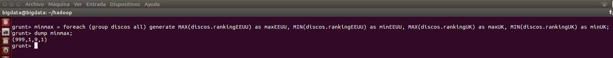

***
# Hadoop: Ejercicios de PIG.
***
- Autor: Juan A. García Cuevas
- Fecha: 17/07/2016

***

Partiendo de la discografía de Pink Floyd (año, nombre disco, ranking EEUU, ranking UK):

    1967, The Piper at the Gates of Dawn,131,6
    1968, A Saucerful of Secrets,999,9
    1969, Music from the Film More,153,9
    1969, Ummagumma,74,5
    1970, Atom Heart Mother,55,1
    1972, Obscured by Clouds, 46,6
    1973, The Dark Side of the Moon, 1,1
    1975, Wish you Were Here, 1,1
    1977, Animals, 3,21979, The Wall, 1,3
    1983, The Final Cut, 6,1
    1987, A Momentary Lapse of Reason,3,3
    1994, The Division Bell, 1,1
    2014, The Endless River, 3, 1

### 1. Crear un fichero llamado discos.txt

```bash
# Creamos en local la carpeta del proyecto y nos posicionamos en ella
mkdir /home/bigdata/ejerciciosPig
cd /home/bigdata/ejerciciosPig

# Creamos el fichero de texto con la discografía de Pink Floyd
gedit discos.txt # ... copiar, pegar, grabar y salir del editor

# Mostramos el inicio del fichero de texto
head discos.txt
```


### 2. Arrancar HDFS, Yarn y el job history

>
>NOTA: deben existir las variables de entorno:
>
>- $HADOOP_HOME=/home/bigdata/hadoop
>
>- $PIG_HOME=/home/bigdata/pig
>

```bash
# Accedemos al directorio de hadoop y arrancamos los demonios del sistema
cd $HADOOP_HOME
./sbin/start-dfs.sh
./sbin/start-yarn.sh
./sbin/mr-jobhistory-daemon.sh start historyserver

# Comprobamos que los demonios estén arrancados
jps
```


### 3. Subir el fichero a HDFS dentro de la carpeta /ejerciciosPig/discografia.txt

```bash
# Copia el fichero de texto al HDFS
hdfs dfs -put discos.txt /ejerciciosPig/discografia.txt

# Comprueba el fichero subido
hdfs dfs -cat /ejerciciosPig/discografia.txt
```


### 4. Ejecutar la instrucción ls sobre Hadoop para indicar el tamaño del fichero

```bash
hdfs dfs -ls /ejerciciosPig/discografia.txt
```


### 5. Arrancar pig en modo distribuido (si se desea eliminar trazas de log) y ejecutar el siguiente comando: cat hdfs://localhost:9000 ejerciciosPig/discografia.txt para confirmar que los primeros puntos han funcionado correctamente y el fichero está subido a HDFS

> Nota: La configuración del nivel de error del log debe estar configurada en el fichero:
>
>       /home/bigdata/pig/conf/nolog.conf
>
> Por ejemplo:
>
>       log4j.rootLogger=fatal

```bash
pig -4 $PIG_HOME/conf/nolog.conf -x mapreduce
cat hdfs://localhost:9000/ejerciciosPig/discografia.txt
```


### 6. Cargar el fichero de hdfs en una variable llamada discos

```bash
discos = LOAD 'hdfs://localhost:9000/ejerciciosPig/discografia.txt' using PigStorage (',') AS (annio: int, nombredisco: chararray, rankingEEUU: int, rankingUK: int);
dump discos;
```


### 7. Calcular los discos que estuvieron a la vez en el top 5 de EEUU y de UK (indicar también el resultado)

```bash
top5 = filter discos by rankingEEUU <= 5 and rankingUK <= 5;
dump top5;
```


### 8. Obtener la máxima y mínima posición que ocuparon los discos de Pink Floyd en EEUU y en UK (indicar también el resultado)  empleando los comandos de LATIN PIG

```bash
# Forma 1
eu = foreach (group discos all) generate MAX(discos.rankingEEUU) as maxEEUU, MIN(discos.rankingEEUU) as minEEUU;
uk = foreach (group discos all) generate MAX(discos.rankingUK) as maxUK, MIN(discos.rankingUK) as minUK;
dump eu;
dump uk;
```


```bash
# Otra forma...
minmax = foreach (group discos all) generate MAX(discos.rankingEEUU) as maxEEUU, MIN(discos.rankingEEUU) as minEEUU, MAX(discos.rankingUK) as maxUK, MIN(discos.rankingUK) as minUK;
dump minmax;

```



    - Max(rankingEEUU) = 999
    - Min(rankingEEUU) = 1
    - Max(rankingUK) = 9
    - Min(rankingUK) = 1


### 9. Explica con tus propias palabras lo que se desea obtener con los siguientes comandos e indica el resultado obtenido.

- a = foreach discos generate anio;
    - Obtener una variable 'a' con todos los años de las canciones de la variable 'discos'.

- b = distinct a;
    - Obtener en una variable 'b' los valores distintos (años) de la variable 'a'.

- dump b;
    - Mostrar el contenido de la variable 'b' (los años distintos).


### 10. (opcional) Empleando UDFs extrae información útil de la discografía.


***

### 99. Detenemos los demonios

```bash
# Accedemos al directorio de hadoop y paramos los demonios del sistema
cd $HADOOP_HOME
./sbin/stop-dfs.sh
./sbin/stop-yarn.sh
./sbin/mr-jobhistory-daemon.sh stop historyserver

# Comprobamos que los demonios no estén arrancados
jps
```

***
