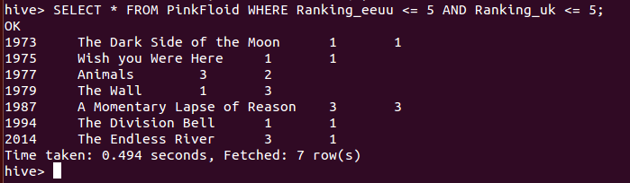

***
# Hadoop: Hive, Ejercicio 1.
***
- Autor: Juan A. García Cuevas
- Fecha: 23/07/2016
***

### 0 En primer lugar iniciamos el sistema (si no lo está ya).

>
>NOTA: deben existir las variables de entorno:
>
>- $HADOOP_HOME=/home/bigdata/hadoop
>
>- $HIVE_HOME=/home/bigdata/hive
>

```bash
# Accedemos al directorio de hadoop y arrancamos los demonios del sistema
cd $HADOOP_HOME
./sbin/start-dfs.sh
./sbin/start-yarn.sh
./sbin/mr-jobhistory-daemon.sh start historyserver

# Comprobamos que los demonios estén arrancados
jps
```


### 1. Crear un fichero de texto con la información anterior (IMPORTANTE: al crear el fichero tener cuidado con los caracteres al final de línea)

```bash
sudo nano /home/bigdata/ejemplosHive/discografia.csv
```
Añadir la discografía de Pink Floyd (año, nombre disco, ranking EEUU, ranking UK) y guardar el archivo

    1967, The Piper at the Gates of Dawn,131,6
    1968, A Saucerful of Secrets,999,9
    1969, Music from the Film More,153,9
    1969, Ummagumma,74,5
    1970, Atom Heart Mother,55,1
    1972, Obscured by Clouds, 46,6
    1973, The Dark Side of the Moon, 1,1
    1975, Wish you Were Here, 1,1
    1977, Animals, 3,2
    1979, The Wall, 1,3
    1983, The Final Cut, 6,1
    1987, A Momentary Lapse of Reason,3,3
    1994, The Division Bell, 1,1
    2014, The Endless River, 3, 1


[discografia.csv](data/discografia.csv)

### 2. Acceder a Hive y crear una base de datos llamada ejercicios

```bash
# Arrancamos la consola de hive:
cd $HIVE_HOME
hive
```

```hive
CREATE DATABASE ejercicios COMMENT 'Almacena los datos del ejercicio 1 de HIVE' WITH DBPROPERTIES ('creator' = 'Juan García', 'date' = '2016-97-23');
```


### 3. Usar la base de datos anterior

```hive
USE ejercicios;
```


### 4. Crear una tabla en Hive en la base de datos anterior que permita almacenar los datos anteriores indicando que el formato de separación es como el siguiente de tipo tabulación (create table ...... (...........) row format delimited fields terminated by ',' stored as textfile;)

```hive
CREATE TABLE PinkFloid(
Anio INT, 
Titulo STRING, 
Ranking_eeuu INT, 
Ranking_uk INT
)
ROW FORMAT DELIMITED FIELDS TERMINATED BY '\,';

```


### 5. Cargar el fichero de texto

```hive
LOAD DATA LOCAL INPATH '/home/bigdata/ejemplosHive/Discografia.csv' INTO TABLE PinkFloid;
```


### 6. Acceder a Hive y ejecutar un consulta sencilla (select *) para verificar que hay datos y se han cargado correctamente. En caso contrario, volver a cargar los datos

```hive
SELECT * FROM PinkFloid;
```


### 7. Calcular los discos que estuvieron a la vez entre los 5 primeros lugares en EEUU y UK

```hive
SELECT * FROM PinkFloid WHERE Ranking_eeuu <= 5 AND Ranking_uk <= 5;
```



### 8. (OPCIONAL) Obtener la máxima y mínima posición que ocuparon los discos de Pink Floyd en EEUU y en UK (por ejemplo empleando el comando order y limit en dos sentencias)


### 9. (OPCIONAL) Repetir todos los ejercicios empleando una tabla con estructuras de datos complejas

```hive
```

***

### 99. Detenemos los demonios

```bash
# Accedemos al directorio de hadoop y paramos los demonios del sistema
cd $HADOOP_HOME
./sbin/stop-dfs.sh
./sbin/stop-yarn.sh
./sbin/mr-jobhistory-daemon.sh stop historyserver

# Comprobamos que los demonios no estén arrancados
jps
```

***
