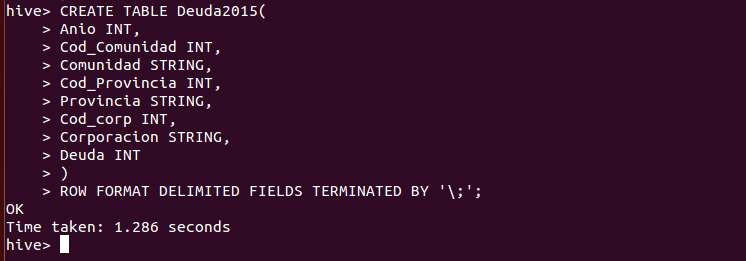
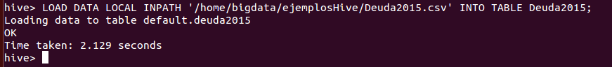
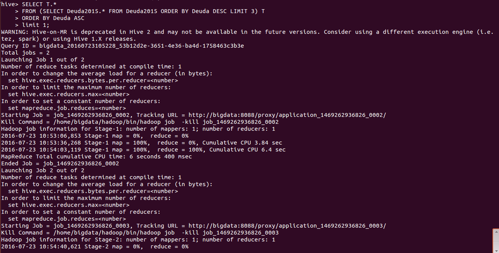
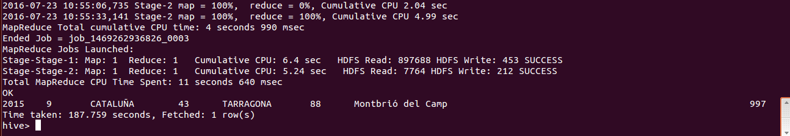
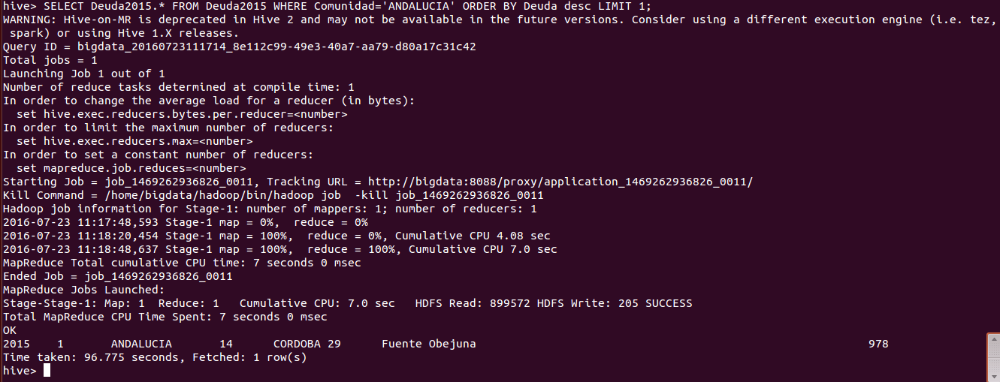
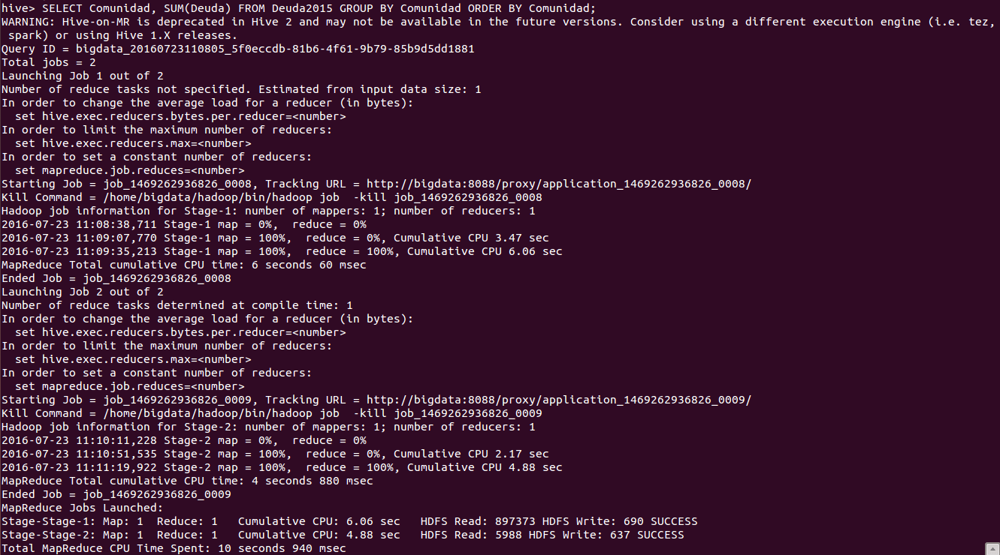
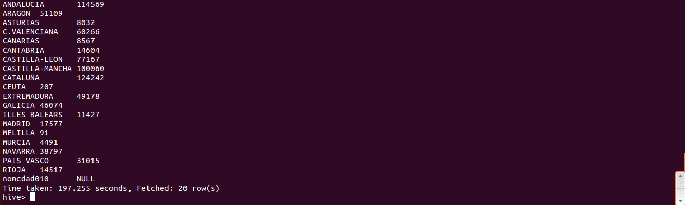
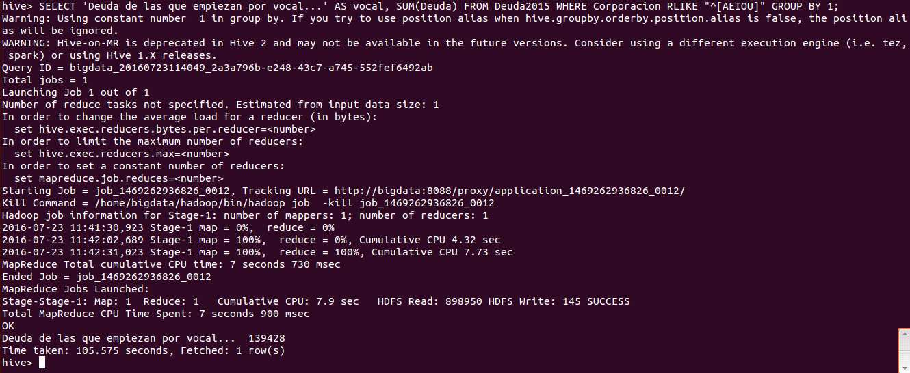
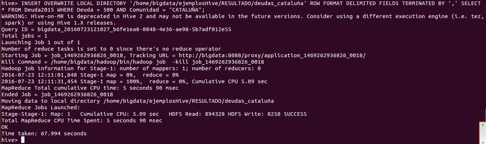

***
# Hadoop: Hive, Ejercicio 2.
***
- Autor: Juan A. García Cuevas
- Fecha: 23/07/2016
***

Acceder a la página:

[http://www.minhap.gob.es/es-ES/Areas%20Tematicas/Administracion%20Electronica/OVEELL/Paginas/DeudaViva.aspx](http://www.minhap.gob.es/es-ES/Areas%20Tematicas/Administracion%20Electronica/OVEELL/Paginas/DeudaViva.aspx)

y descargar el fichero de deuda de ayuntamientos del año 2015.

Una vez descargado y abierto para analizar su información, resolver los siguientes ejercicios:


### 0.1 En primer lugar descargamos y tratamos el fichero de datos

Abrimos el fichero [Deuda Viva Ayuntamientos 2015__OVEL_20160506.xls](data/Deuda Viva Ayuntamientos 2015__OVEL_20160506.xls) descargado, eliminamos las líneas de la cabecera y el pié de documento y lo guardamos en formatro CSV con el caracter ';' como delimitador de campos: [Deuda2015.csv](data/Deuda2015.csv)

### 0.2 Luego iniciamos el sistema (si no lo está ya) y arrancamos la consola de hive.

>
>NOTA: deben existir las variables de entorno:
>
>- $HADOOP_HOME=/home/bigdata/hadoop
>
>- $HIVE_HOME=/home/bigdata/hive
>

```bash
# Accedemos al directorio de hadoop y arrancamos los demonios del sistema
cd $HADOOP_HOME
./sbin/start-dfs.sh
./sbin/start-yarn.sh
./sbin/mr-jobhistory-daemon.sh start historyserver

# Comprobamos que los demonios estén arrancados
jps

# Arrancamos la consola de hive
cd $HIVE_HOME
hive
```


### 1. Indicar el comando de creación de una tabla en Hive que contenga la información de la solapa datos con las siguientes columnas:
- Anio
- Cod_Comunidad
- Comunidad
- Cod_Provincia
- Provincia
- Cod_corp
- Corporacion
- Deuda

```hive
CREATE TABLE Deuda2015(
Anio INT, 
Cod_Comunidad INT, 
Comunidad STRING, 
Cod_Provincia INT, 
Provincia STRING, 
Cod_corp INT, 
Corporacion STRING, 
Deuda INT
)
ROW FORMAT DELIMITED FIELDS TERMINATED BY '\;';
```



### 2. Cargar el fichero anterior descargado en esa tabla e indicar el comando empleado

```hive
LOAD DATA LOCAL INPATH '/home/bigdata/ejemplosHive/Deuda2015.csv' INTO TABLE Deuda2015;
```



### 3. Obtener la corporación que tiene la tercera deuda más grande

```hive
SELECT T.* 
FROM (SELECT Deuda2015.* FROM Deuda2015 ORDER BY Deuda DESC LIMIT 3) T 
ORDER BY Deuda ASC
LIMIT 1;
```




### 4. Obtener la corporación que tiene la deuda más grande de Andalucía

```hive
SELECT Deuda2015.* 
FROM Deuda2015 
WHERE Comunidad = 'ANDALUCIA' 
ORDER BY Deuda DESC 
LIMIT 1;
```



***
# OPCIONALES
***

### 5. Obtener la suma de deudas de cada comunidad autónoma ordenadas por comunidad

```hive
SELECT Comunidad, SUM(Deuda) 
FROM Deuda2015 
GROUP BY Comunidad 
ORDER BY Comunidad;
```




### 6. Obtener la suma de las deudas de las corporaciones que empiezan por vocal

```hive
SELECT 'Deuda de las que empiezan por vocal...' AS vocal, SUM(Deuda) 
FROM Deuda2015 
WHERE Corporacion RLIKE "^[AEIOU]" 
GROUP BY 1;
```



### 7. Exportar las corporaciones cuya deuda sea mayor a 10.000 y pertenezcan a Cataluña a un fichero llamado deudas y adjuntarlo. Puedes emplear un comando similar al siguiente:

_INSERT OVERWRITE LOCAL DIRECTORY '/home/bigdata/ejemplosHive/RESULTADO/' row format delimited fields terminated by ',' select *
from ........._

>NOTA: En los datos la mayor deuda para una corporación de Cataluña es de 997. Por ello realizo la consulta con otro valor, por ejemplo > 500.

```hive
INSERT OVERWRITE LOCAL DIRECTORY '/home/bigdata/ejemplosHive/RESULTADO/deudas_cataluña' 
ROW FORMAT DELIMITED FIELDS TERMINATED BY ',' 
SELECT * FROM Deuda2015 WHERE Deuda > 500 AND Comunidad = "CATALUÑA";
```

>
> Otra forma:
> INSERT OVERWRITE LOCAL DIRECTORY '/home/bigdata/ejemplosHive/RESULTADO/deudas_cataluña' ROW FORMAT DELIMITED FIELDS TERMINATED BY ',' SELECT * FROM Deuda2015 WHERE Deuda > 500 AND Cod_Comunidad = 9;
>



El resultado se encuentra en el fichero [RESULTADO/deudas_cataluña/000000_0](RESULTADO/deudas_cataluña/000000_0)

***

### 99. Detenemos los demonios

```bash
# Accedemos al directorio de hadoop y paramos los demonios del sistema
cd $HADOOP_HOME
./sbin/stop-dfs.sh
./sbin/stop-yarn.sh
./sbin/mr-jobhistory-daemon.sh stop historyserver

# Comprobamos que los demonios no estén arrancados
jps
```

***
