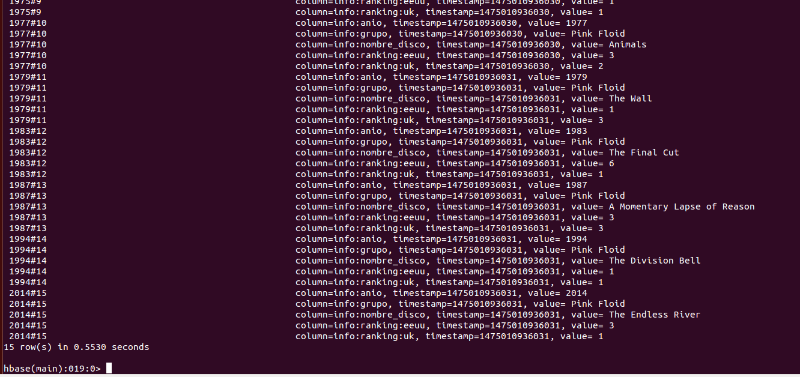

***
# Ejercicio con HBase:
# Discografía de Pink Floid y Green Day.
***
- Autor: Juan A. García Cuevas
- Fecha: 25/09/2016


***

## ENUNCIADO:

Partiendo de los datos de la discografía de álbumes de estudio de Pink Floyd: [Discografía de Pink Floid](http://es.wikipedia.org/wiki/Anexo:Discograf%C3%ADa_de_Pink_Floyd):

```
Año Album Ranking Certificación EEUU Ranking Certificación UK
1967 The Piper at the Gates of Dawn 131 6
1968 A Saucerful of Secrets — 9
1969 Music from the Film More 153 9
1969 Ummagumma (Disco 2) 74 5
1970 Atom Heart Mother 55 1
1971 Meddle 70 3
1972 Obscured by Clouds 46 6
1973 The Dark Side of the Moon 1 1
1975 Wish You Were Here 1 1
1977 Animals 3 2
1979 The Wall 1 3
1983 The Final Cut 6 1
1987 A Momentary Lapse of Reason 3 3
1994 The Division Bell 1 1
2014 The Endless River 3 1
```

Resolver las siguientes preguntas:

1. Crear un namespace llamado discografía
2. Crear una tabla llamada discos que contenga sólo las columnas: grupo, nombre_disco, anio,
ranking (a su vez tendrá identificadores para EEUU y UK)
3. Cargar los datos en HBase (se pueden emplear los comandos put o una importación desde PIG).
Nota: algunos años hay más de un disco por lo que la clave será el año y un secuencial, y no se
disponen de todos los datos de rankings por lo que esos datos nulos no será necesario cargarlos
4. Escribir la instrucción y el resultado de consultar el álbum del año 1968
5. Añadir la información de los álbumes de estudio de GreenDay
https://en.wikipedia.org/wiki/Green_Day_discography
6. Ejecuta varias instrucciones (describiéndolas) para analizar datos anteriores

***

## Arrancamos HBase, accedemos a la consola y comprobamos el estado
Abrimos un terminal shell y ejecutamos:
```bash
cd /home/bigdata/hbase
bin/start-hbase.sh
jps
bin/hbase shell
```
```hbase
status
```


## 1. Creamos el namespace 'discografia'
```hbase
create_namespace 'discografia'
```


## 2. Creamos la tabla 'discos'
```
create 'discografia:discos', 'info', 'ranking'
scan 'discografia:discos'
describe 'discografia:discos'
```


## 3. Cargamos los datos en HBase mediante una importación desde PIG. La clave será el año y un secuencial.
Podríamos hacerlo directamente dede la shell de HBase mediante comandos put de la siguiente manera:
```
put 'discografia:discos', '1967#1', 'info:anio', 1967
put 'discografia:discos', '1967#1', 'info:grupo', 'Pink Floyd'
put 'discografia:discos', '1967#1', 'info:nombre_disco', 'The Piper at the Gates of Dawn'
put 'discografia:discos', '1967#1', 'ranking:eeuu', 131
put 'discografia:discos', '1967#1', 'ranking:uk', 6
...
scan 'discografia:discos'
```


Pero vamos a hacerlo usando PIG para leer un fichero de datos CSV y cargarlo en HBase.

Antes de nada eliminaremos los datos insertados:
```
deleteall 'discografia:discos', '1967#1'
scan 'discografia:discos'
```

### 3.1 Creamos un fichero CSV con los datos de la discografía de Pink Floid:
[PinkFloid.csv](data/PinkFloid.csv)

```bash
sudo nano /home/bigdata/ejemplosHBase/PinkFloid.csv
```
```csv
1967#1, 1967, Pink Floid, The Piper at the Gates of Dawn, 131, 6
1968#2, 1968, Pink Floid, A Saucerful of Secrets, , 9
1969#3, 1969, Pink Floid, Music from the Film More, 153, 9
1969#4, 1969, Pink Floid, Ummagumma (Disco 2), 74, 5
1970#5, 1970, Pink Floid, Atom Heart Mother, 55, 1
1971#6, 1971, Pink Floid, Meddle, 70, 3
1972#7, 1972, Pink Floid, Obscured by Clouds, 46, 6
1973#8, 1973, Pink Floid, The Dark Side of the Moon, 1, 1
1975#9, 1975, Pink Floid, Wish You Were Here, 1, 1
1977#10, 1977, Pink Floid, Animals, 3, 2
1979#11, 1979, Pink Floid, The Wall, 1, 3
1983#12, 1983, Pink Floid, The Final Cut, 6, 1
1987#13, 1987, Pink Floid, A Momentary Lapse of Reason, 3, 3
1994#14, 1994, Pink Floid, The Division Bell, 1, 1
2014#15, 2014, Pink Floid, The Endless River, 3, 1
```

### 3.2 Creamos el fichero PIG para cargar el fichero CSV:
[carga_PinkFloid.pig](bin/carga_PinkFloid.pig)

```bash
sudo nano /home/bigdata/ejemplosHBase/carga_PinkFloid.pig
```
```pig
-- Cargamos las librerías Java
register '/home/bigdata/hbase/lib/hbase-common-1.2.1.jar';
register '/home/bigdata/hbase/lib/hbase-client-1.2.1.jar';
register '/home/bigdata/hbase/lib/protobuf-java-2.5.0.jar';

-- Cargamos el fichero csv empleando el separador , en los campos id, anio, grupo, nombre_disco, eeuu y uk
datos = LOAD '/home/bigdata/ejemplosHBase/PinkFloid.csv' USING PigStorage( ',' ) AS (
id: chararray,
anio: int,
grupo: chararray,
nombre_disco: chararray,
eeuu: int,
uk: int );

-- Cargamos los datos en la tabla discos del namespace discografia de HBase
STORE datos INTO 'hbase://discografia:discos'
USING org.apache.pig.backend.hadoop.hbase.HBaseStorage ('info:anio info:grupo info:nombre_disco ranking:eeuu ranking:uk');
```

### 3.3 Ejecutamos el comando de carga de datos de la discografía de Pink Floid
Abrimos un segundo terminal y ejecutamos:
```
pig -x local /home/bigdata/ejemplosHBase/carga_PinkFloid.pig
```


### 3.4 Comprobamos el contenido de la tabla 'discografia:discos'
En el primer terminal:
```
scan 'discografia:discos'
describe 'discografia:discos'
```



## 4. Escribir la instrucción y el resultado de consultar el álbum del año 1968
```
get 'discografia:discos','1968#2'


    !!!!!!!!!!!!!!!!!!!!!!!!!!!!!!!!!


    import org.apache.hadoop.hbase.util.Bytes
    import org.apache.hadoop.hbase.filter.SingleColumnValueFilter
    import org.apache.hadoop.hbase.filter.BinaryComparator
    import org.apache.hadoop.hbase.filter.CompareFilter
    scan 'discografia:discos', { FILTER => SingleColumnValueFilter.new(Bytes.toBytes('cf'), Bytes.toBytes('anio'), CompareFilter::CompareOp.valueOf('EQUAL'), BinaryComparator.new(Bytes.toBytes('1968')))}
    scan 'discografia:discos', { COLUMNS => 'anio', FILTER => "ValueFilter(=, 'number:1968')" }
    scan 'discografia:discos', { COLUMNS => 'nombre_disco', FILTER => "DependentColumnFilter('anio', =, 1968)" }
    scan 'discografia:discos', { COLUMNS => 'temperatura:max', FILTER => "ValueFilter( >, 'binary:12' )" }


```

## 5. Añadir la información de los álbumes de estudio de GreenDay

[Discografía de Grren Day](https://en.wikipedia.org/wiki/Green_Day_discography)

### 5.1 Creamos un fichero CSV con los datos de la discografía de Green Day:
[GreenDay.csv](data/GreenDay.csv)

```bash
sudo nano /home/bigdata/ejemplosHBase/GreenDay.csv
```
```csv
1990#20, 1990, Green Day, 39/Smooth, ,
1992#21, 1992, Green Day, Kerplunk, ,
1994#22, 1994, Green Day, Dookie, 2, 13
1995#23, 1995, Green Day, Insomniac, 2, 8
1997#24, 1997, Green Day, Nimrod, 10, 11
2000#25, 2000, Green Day, Warning, 4, 4
2004#26, 2004, Green Day, American Idiot, 1, 1
2009#27, 2009, Green Day, 21st Century Breakdown, 1, 1
2012#28, 2012, Green Day, ¡Uno!, 2, 2
2012#29, 2012, Green Day, ¡Dos!, 9, 10
2012#30, 2012, Green Day, ¡Tré!, 13, 31
```

### 5.2 Creamos el fichero PIG para cargar el fichero CSV:
[carga_GreenDay.pig](bin/carga_GreenDay.pig)

```bash
sudo nano /home/bigdata/ejemplosHBase/carga_GreenDay.pig
```
```pig
-- Cargamos las librerías Java
register '/home/bigdata/hbase/lib/hbase-common-1.2.1.jar';
register '/home/bigdata/hbase/lib/hbase-client-1.2.1.jar';
register '/home/bigdata/hbase/lib/protobuf-java-2.5.0.jar';

-- Cargamos el fichero csv empleando el separador , en los campos id, anio, grupo, nombre_disco, eeuu y uk
datos = LOAD '/home/bigdata/ejemplosHBase/GreenDay.csv' USING PigStorage( ',' ) AS (
id: chararray,
anio: int,
grupo: chararray,
nombre_disco: chararray,
eeuu: int,
uk: int );

-- Cargamos los datos en la tabla discos del namespace discografia de HBase
STORE datos INTO 'hbase://discografia:discos'
USING org.apache.pig.backend.hadoop.hbase.HBaseStorage ('info:anio info:grupo info:nombre_disco ranking:eeuu ranking:uk');
```

### 5.3 Ejecutamos el comando de carga de datos de la discografía de Green Day
Abrimos un segundo terminal y ejecutamos:
```
pig -x local /home/bigdata/ejemplosHBase/carga_GreenDay.pig
```


### 5.4 Comprobamos el contenido de la tabla 'discografia:discos'
```
scan 'discografia:discos'
describe 'discografia:discos'
```


## 6. Ejecuta varias instrucciones (describiéndolas) para analizar datos anteriores

### 6.1 Leer una fila
```
get 'discografia:discos', '2014#15'
```


### 6.2 Leer una columna de una fila (celda)
```
get 'discografia:discos', '2014#15', 'info:nombre_disco'
```


### 6.3 Otra forma de leer una columna de una fila (celda)
```
get 'discografia:discos', '2014#15', {COLUMN=>'info:nombre_disco'}
```


### 6.4 Leer una columna de la tabla
```
scan 'discografia:discos', { COLUMN => 'info:nombre_disco' }
```


### 6.5 Leer una columna de 5 filas
```
scan 'discografia:discos', { COLUMN => 'info:nombre_disco', LIMIT => 5 }
```


### 6.6 Leer varias columnas de 5 filas
```
scan 'discografia:discos', { COLUMN => ['info.anio', 'info:nombre_disco'], LIMIT => 5 }
```


### 6.7 Leer varias columnas de 3 filas, empezando a partir de una fila determinada
```
scan 'discografia:discos', { COLUMN => ['info.anio', 'info:nombre_disco'], LIMIT => 5, STARTROW => '1983#12' }
```


### 6.8 Leer valores de ranking en EEUU mayor que 10
```
scan 'discografia:discos', { COLUMN => 'ranking:eeuu', FILTER => "ValueFilter( >, 'binary:10' )" }
```


### 6.8 Obtener la fecha de inserción de un dato
```
Time.at(1475096306895/1000)
```


============================================


!!!!!!!!!!!!!!!!!!!!!!!!!!!!!!!!!!!!!!

disable 'discografia:discos'
drop 'discografia:discos'
create 'discografia:discos', 'info'
scan 'discografia:discos'
describe 'discografia:discos'

scan 'discografia:discos'
get 'discografia:discos','1968#2'

pig -x local carga_PinkFloid.pig
pig -x local carga_GreenDay.pig

deleteall 'discografia:discos', '1967#1'


