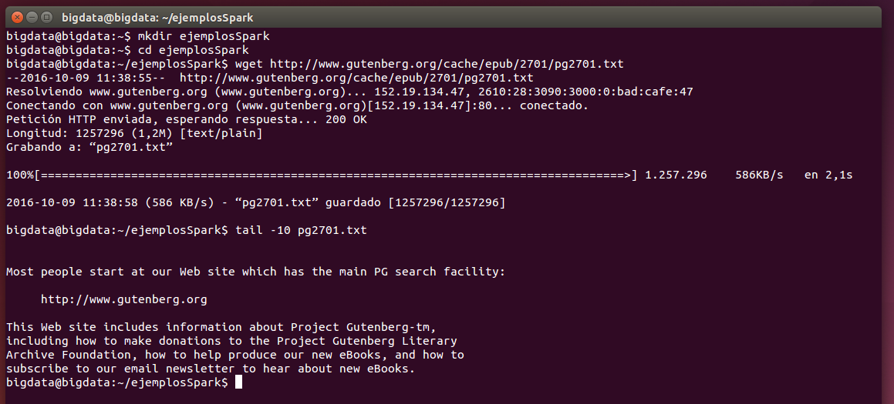
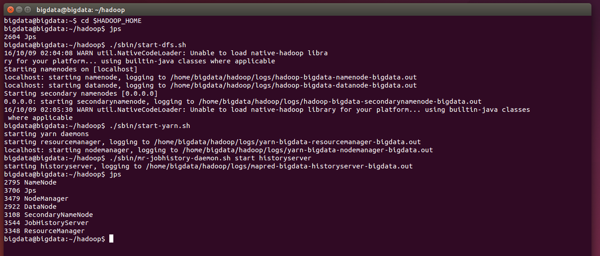
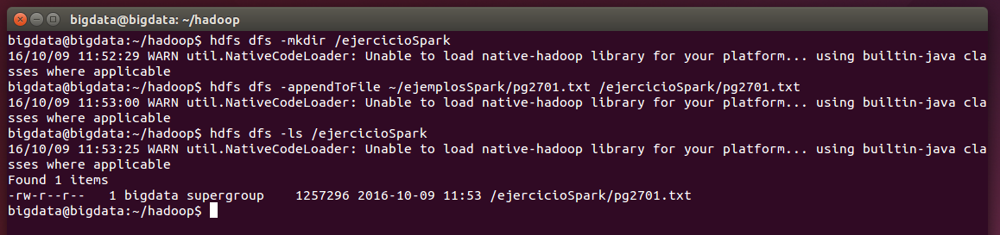
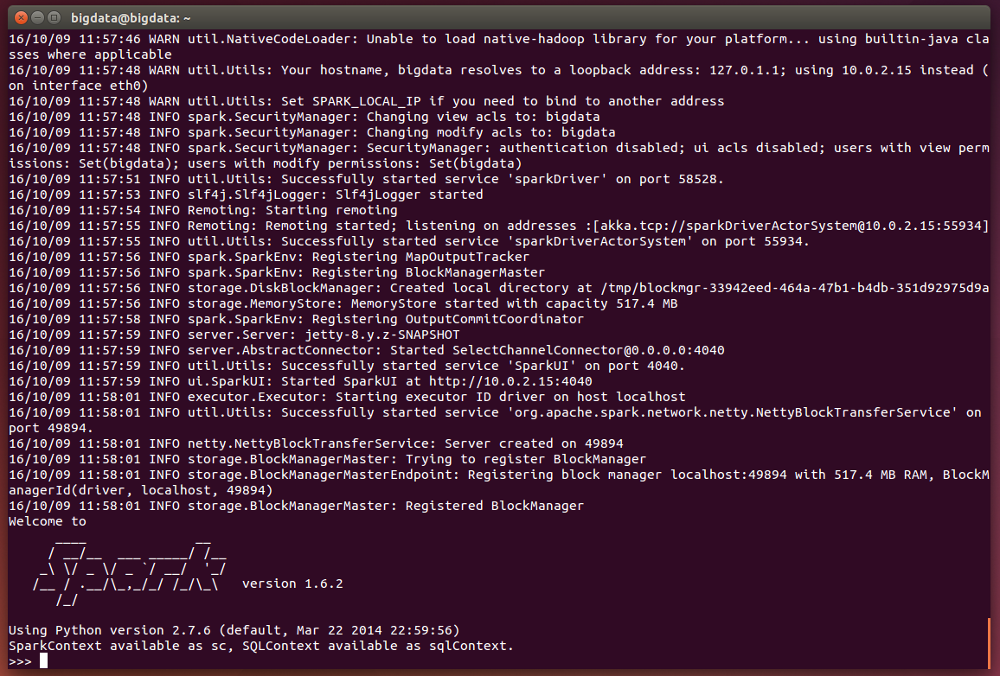
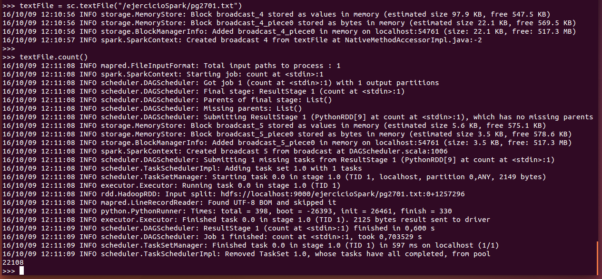
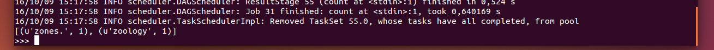
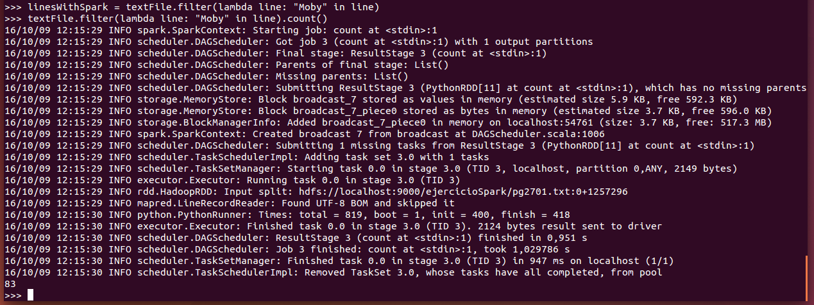

***
# Ejercicios de SPARK:
***
- Autor: Juan A. García Cuevas
- Fecha: 09/10/2016

***
# ENUNCIADO:

EJERCICIOS DE SPARK

1. Recuperar el libro de Moby Dick del proyecto gutenberg

    [http://www.gutenberg.org/cache/epub/2701/pg2701.txt](http://www.gutenberg.org/cache/epub/2701/pg2701.txt)

2. Crear una carpeta ejercicioSpark en HDFS
3. Subir el fichero a HDFS a la carpeta anterior
4. Comprobar que el libro está correctamente subido
5. Acceder a pyspark
6. Indicar los comandos y el resultado de contar el número de líneas que tiene el fichero
7. Ejecutar un word count e indicar ordenadas alfabéticamente las dos últimas palabras que aparecen y el número de repeticiones
8. Indicar las instrucciones y el valor devuelto del número de líneas en las que aparece la palabra Moby en el libro
9. Describe con tus palabras las diferencias de usar Spark frente a Map Reduce

***
# RESULTADO:

## Creamos el directorio ejemplosSpark en local y descargamos el libro de Moby Dick del proyecto Gutenberg
- Abrimos un terminal.
- Desde la línea de comandos del S.O.:
```bash
mkdir ejemplosSpark
cd ejemplosSpark
wget http://www.gutenberg.org/cache/epub/2701/pg2701.txt
tail -10 pg2701.txt
```


El fichero puede verse en esta url: [pg2701.txt](data/pg2701.txt)

***
## Accedemos al directorio de hadoop y arrancamos y comprobamos los demonios del sistema
- Desde la línea de comandos del S.O.:
```bash
cd $HADOOP_HOME
jps
./sbin/start-dfs.sh
./sbin/start-yarn.sh
./sbin/mr-jobhistory-daemon.sh start historyserver
jps
```



***
## Creamos una carpeta ejercicioSpark en HDFS y subimos el fichero
- Desde línea de comandos del S.O.
```bash
hdfs dfs -mkdir /ejercicioSpark
hdfs dfs -appendToFile ~/ejemplosSpark/pg2701.txt /ejercicioSpark/pg2701.txt
hdfs dfs -ls /ejercicioSpark
```



***
## Accedemos a pyspark
- Desde línea de comandos del S.O.
```bash
pyspark
```



***
## Cargamos el fichero y contamos el número de líneas
- Desde línea de comandos del cliente pyspark
```bash
# Cargamos el fichero de texto en un objeto RDD
textFile = sc.textFile("/ejercicioSpark/pg2701.txt")
# Obtenemos el número elementos del objeto RDD (filas del texto)
textFile.count()
```



***
## Ejecutamos word count y mostramos, ordenadas alfabéticamente, las dos últimas palabras que aparecen y el número de repeticiones
- Desde línea de comandos del cliente pyspark
```bash
# Obtenemos un arraylist con las palabras y el número de apariciones
wordCounts = textFile.flatMap(lambda line: line.split()).map(lambda word: (word, 1)).reduceByKey(lambda a, b: a+b)
## Ordenamos alfabéticamente y mostramos las dos últimas palabras y el número de repeticiones
wordCounts.sortBy(lambda x: x[0]).collect()[wordCounts.count()-2:wordCounts.count()]
```


***
## Obtenemos el número de líneas en las que aparece la palabra Moby en el libro
- Desde línea de comandos del cliente pyspark
```bash
# Creamos un nuevo RDD como resultado de filtra las líneas de texto que contienen la palabra Moby
linesWithSpark = textFile.filter(lambda line: "Moby" in line) 
# Obtenemos el número de líneas de texto que contienen la palabra Moby
textFile.filter(lambda line: "Moby" in line).count()

```



***
## Diferencias entre Map Reduce y Spark

- **Map Reduce** y **Spark** son motores de procesamiento de datos, dos productos tecnológicos diferentes que fueron diseñados para operar en un mismo contexto. Los dos hacen muchas cosas similares aunque con algunas diferencias.

- La principal diferencia entre Map Reduce y Spark es que:
    - **Map Reduce** es una tecnología basada estrictamente en discos y utiliza almacenamiento persistente.
    - **Spark** utiliza memoria para el procesamiento de datos (aunque también puede usar discos).

- A continuación repasaremos con más detalle algunas de las diferencias:

    - _Pocesamiento de datos_
        - **Map Reduce** utiliza procesamiento batch (por lotes). Fue creado originalmente para recoger información de sitios Web en forma continua, sin necesidad de tener acceso a esos datos en tiempo real o casi real, por lo que no fue creado para tener gran velocidad.
        - **Spark** utiliza procesamiento in-memory, por lo que es mucho más rápido que MapReuce, aunque también puede utilizar discos cuando los datos no caben en memoria.

    - _Facilidad de Uso_
        - **Map Reduce** no dispone de modo interactivo, aunque se consigue que su uso sea un poco más sencillo con algunos add-ons como Pig o Hive.
        - **Spark** ha ganado reconocimiento por su facilidad de uso gracias a su API (Application Programming Interface) amigable para SCALA, su lenguaje nativo y también para Java, Python y Spark SQL. Spark tiene también un modo interactivo con el que desarrolladores y usuarios pueden obtener respuestas inmediatas en consultas y otras acciones.

    - _Coste_
        - MapReduce y Spark son proyectos de Apache.org, de softwre libre y por tanto sin coste.
        - Los dos han sido diseñados para funcionar en hardware estándar, en sistemas llamados de caja blanca (compatibles) o servidores de bajo coste.
        - Aún así, existen costes asociados a la utilización de cualquiera de las dos plataformas en términos de hardware y personal.
        - **Map Reduce** funciona principalmente en disco, por lo que necesitará disponer de un mayor número de máquinas para poder distribuir la actividad de entrada y salida de disco. Por el contrario, los requerimientos de memoria no se ven alterados respecto a los considerados estándar.
        - **Spark** funciona principalmente en memoria, por lo que necesitará disponer de gandes cantidades de memoria RAM. Por el contrario, los requerimientos de espacio en disco no se ven alterados respecto a los considerados estándar en términos de capacidad y velocidad. La tecnología Spark reduce también el número de sistemas necesarios para poder funcionar.
        - Aunque Spark resulta más caro por necesidad de memoria RAM, Map Reduce puede requerir costes mayores de hardware y mantenimiento, al precisar un número mayor de sistemas.

    - _Compatibilidad_
        - **Map Reduce** y **Spark** son compatibles entre sí y Spark comparte todas las compatibilidades de Map Reduce para fuentes de datos, formatos de archivos y herramientas de BI (Business Intelligence) vía JDBC (Java Database Connectivity) y ODBC (Open Database Connectivity).

    - _Escalabilidad_
        - Tanto **Map Reduce** como **Spark** son escalables utilizando HDFS. Yahoo tiene un cluster de 42.000 nodos con Map Reduce y el cluster de Spark más grande conocido es de 8.000 nodos. A medida que crece el big data es de esperar que esos tamaños de cluster sigan creciendo.

    - _Tolerancia a Fallos_
        - MapReduce y Spark resuelven la tolerancia ante fallos de dos formas diferentes.
        - **MapReduce** utiliza TaskTrackers que suministran “_latidos_” al módulo JobTracker, de modo que si un latido se pierde, el JobTracker reprograma todas las operaciones pendientes y en ejecución para otro TaskTracker. Este método es efectivo para lograr tolerancia ante fallos pero puede incrementar notablemente los tiempos de ejecución.
        - **Spark** utiliza RDDs (Resilient Distributed Datasets) que son colecciones de elementos con tolerancia a fallos y que pueden ser operados en paralelo. Los RDDs pueden referenciar a un conjunto de datos en un sistema externo de almacenamiento, tal como un file system compartido, HDFS, HBase o cualquier otra fuente de datos que tenga el InputFormat de Hadoop. Spark puede crear RDDs desde cualquier fuente de almacenamiento soportada por Hadoop, incluyendo file systems locales u otros de los antes mencionados.

    - _Seguridad_
        - Hadoop soporta autenticación Kerberos, que es algo difícil de administrar. Sin embargo, algunos proveedores han facilitado el aprovechamiento de Active Directory Kerberos y LDAP para autenticación, y ofrecen encriptado de datos para datos en reposo y en movimiento.
        - Hadoop Distributed File System soporta ACL (Access Control Lists) y el modelo tradicional de permisos de acceso a archivos.
        - Hadoop cuenta con Service Level Authorization para el control de usuarios y lanzamiento de procesos, que asegura que los clientes tengan los permisos correctos.
        - La seguridad de Spark es un poco más escasa en términos de recursos. Actualmente sólo soporta autenticación vía paswords. Si se corre Spark sobre HDFS, se pueden usar los permisos HDFS ACL y a nivel de archivo. Además, Spark puede utilizar a YARN para alcanzar la capacidad de utilizar autenticación Kerberos.

- Ejemplo comparativo: Spark ganó la edición de Daytona GraySort Benchmark de 2014, al clasificar 100 TB de datos 3 veces más rápido que Map Reduce y en una décima parte de la cantidad de máquinas requeridas.

- Conclusiones:
    - Hadoop y Spark no son mutuamente excluyentes, tienen relaciones simbióticas, ninguno de los dos es un reemplazo total del otro, los dos son compatibles entre sí.
    - Hadoop ofrece elementos que Spark no tiene, como sistemas de archivos distribuidos, y Spark ofrece procesamiento in-memory en tiempo real para aquellos conjuntos de datos que así lo requieran. 
    - Por tanto, Hadoop y Spark trabajando juntos en un mismo equipo es una solución muy poderosa que puede aplicarse a una gran variedad de aplicaciones big data.

- _Glosario_
    - **Map Reduce** es un framework de software creado por Google para dar soporte a la computación paralela sobre grandes colecciones de datos en grupos de computadoras y al commodity computing. MapReduce ha sido implementado en soluciones como Apache Hadoop, MongoDB, Riak, CouchBase, Couchdb, Infinispan...
    - **Apache Hadoop** es un framework de software que soporta aplicaciones distribuidas, permitendo a las aplicaciones trabajar con miles de nodos y petabytes de datos. Hadoop se inspiró en los documentos Google para MapReduce y Google File System (GFS).
    - **HDFS** (Hadoop's Distributed File System) es un sistema de ficheros distribuido.

***
## Referencias
- [Pyspark package](https://spark.apache.org/docs/1.2.0/api/python/pyspark.html#pyspark.RDD)
- [Big Data: Hadoop y Spark ¿Competencia o complemento?](http://www.datamation.com.ar/big-data-hadoop-y-spark-competencia-o-complemento-7509)
- [MapReduce](https://es.wikipedia.org/wiki/MapReduce)
- [Hadoop](https://es.wikipedia.org/wiki/Hadoop)


***
## ANEXO: algunas consultas de ejemplo más sobre el objeto RDD wordCounts
```bash
# Obtiene el número de elementos
wordCounts.count()
# Obtiene el mayor valor en el RDD.
wordCounts.max()
# Obtiene el menor valor en el RDD.
wordCounts.min()
# Obtiene la primera fila
wordCounts.first()
# Obtiene un nuevo RDD con los distintos elementos en el RDD actual
wordCounts.distinct()
# Ordena por palabras
wordCounts.sortBy(lambda x: x[0])
# Ordena por número de ocurrencias
wordCounts.sortBy(lambda x: x[1])
# Ordena por número de ocurrencias en sentido descendente y muestra las dos primeras
wordCounts.sortBy(lambda x: x[1], ascending=False).collect()[0:2]
```

***
